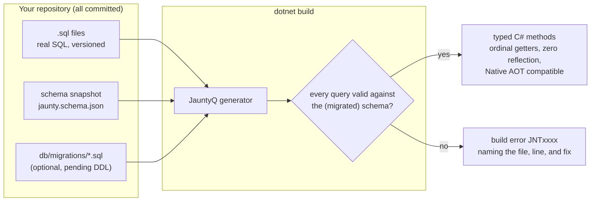
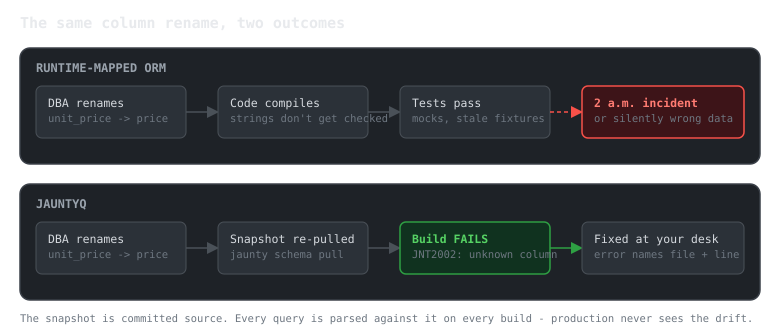

# Why JauntyQ (and Why Not)

JauntyQ moves the ORM to compile time. You write real SQL in `.sql` files; a Roslyn source generator validates every query against a schema snapshot you committed, and emits the fastest C# it knows how to write: typed getters by ordinal, explicit parameter types, no reflection, no runtime SQL parsing. The runtime package is intentionally near-empty - the generated code carries everything.

This page is the honest pitch: the problems JauntyQ solves, the ones it deliberately does not, and how to know quickly if it fits.

## The core idea in one diagram

Rename a column, drop a table, shrink a `varchar` - the build breaks at your desk, with the query file and reason in the error list. Not in staging. Not at 2 a.m.

## The problems JauntyQ solves

**Schema drift discovered too late.** The classic ORM failure: the database changes, the code compiles fine, and the mismatch surfaces as a runtime exception or - worse - silently wrong data. In JauntyQ the schema snapshot is part of your source tree and every query is parsed against it on every build. `jauntyq schema verify` closes the loop against the live database (exit 0 = match, exit 2 = drift, differences listed); it is a paid verb, and the free tool exits `3` pointing at the install line.

**Runtime mapping cost.** There is nothing to optimize at runtime because nothing happens at runtime: no reflection, no per-row boxing, no SQL parsing, typed ordinal getters emitted per query. A one-time shape guard validates each result set on first use, then gets out of the way. The generated code is Native AOT and trim compatible by construction.

**CRUD boilerplate.** From the snapshot alone - zero `.sql` files - every table gets synthesized `GetAll`, `GetById`, `Insert` (returning the new identity), `Update`, `Delete`, `Upsert` (dialect-native `MERGE` / `ON CONFLICT` / `ON DUPLICATE KEY`), `BulkInsert`, and `GetBy<ForeignKey>` loaders, in sync and async forms, with POCO overloads. Write `.sql` only for the queries that are actually yours; a user file with the same entity and method name overrides the synthetic.

**Bad SQL that "works".** The build also reviews your queries: cartesian joins (JNT8001), non-sargable predicates like functions on filtered columns (JNT8002), leading-wildcard `LIKE` (JNT8003), filters and joins on unindexed columns (JNT8004), duplicate queries (JNT8005), joins that match no declared foreign key (JNT8006), `ORDER BY` on an unindexed column (JNT8007), N+1 access patterns (JNT8008), and pages taken without a deterministic row order (JNT8009/JNT8010, a `LIMIT`/`OFFSET` whose `ORDER BY` is not tiebroken on something unique, so rows silently repeat or vanish between pages) surface as build warnings, using the index metadata and foreign-key graph in your snapshot.

**Values the database will reject or truncate.** String longer than the column's `nvarchar(40)`? Decimal that cannot fit `decimal(19,4)`? Those are build errors (JNT5001/JNT5002) and guarded client-side with exact messages, not a `SqlException` after the round trip.

**Migrations as a blind spot.** Put pending DDL in `db/migrations/*.sql` and the generator simulates it onto the snapshot before validating - so a query against a column your next migration drops is a build error today, while the migration is still in review.

**Lost updates.** SQL Server `rowversion` columns are understood natively: excluded from inserts, appended to `UPDATE`/`DELETE` predicates, zero rows affected = conflict. Optimistic concurrency without a tracking layer.

## What JauntyQ deliberately does not do

- **It does not hide SQL.** There is no LINQ provider and no query builder. If writing SQL is a problem for your team, JauntyQ is not your tool - EF Core is over there.
- **No runtime query composition.** Queries are known at compile time, period. Dynamic search screens that assemble SQL from user input need a different tool (its sibling [Jaunty](https://extrode.com/jaunty) handles runtime shapes).
- **No change tracking, no identity map, no lazy loading.** Row POCOs are plain data.
- **`SELECT *` is a build error** (JNT3002), with a paste-ready explicit column list in the message. Star projections are how shape drift sneaks in; JauntyQ closes that door on purpose.
- **It demands snapshot discipline.** The schema snapshot is committed and re-pulled when the database changes. If your team cannot keep that habit, the build errors will feel like friction rather than protection.
- **.NET SDK 8.0+ to build.** The generator runs inside Roslyn 4.12 (SDK
  8.0.400+/VS 17.12+); your consuming project's own TargetFramework isn't
  restricted to net8.0 - `Extrode.JauntyQ.Runtime` also ships a netstandard2.0 target.
- **One honest boxing caveat.** Parameter values box once per call at the ADO.NET boundary (`DbParameter.Value` is `object`) - every data library pays this; on PostgreSQL JauntyQ avoids even that with typed `NpgsqlParameter<T>`. The read path allocates nothing per row beyond your POCO.
- **Not open source.** JauntyQ is source-available, not OSI-approved: the free core is licensed under the ISL-R (source viewable, use permitted) with a Generated Output Exception covering the code it emits into your project, and the paid team-safety tooling ships under the ISL-EULA. See [pricing](pricing.md). Hard OSS requirement? Use Dapper or EF Core.

## JauntyQ or Jaunty?

Same philosophy - SQL is yours, mapping is strict, reflection is not welcome - different binding time.

| You have | Pick |
|---|---|
| Queries known at build time, team willing to commit a schema snapshot | **JauntyQ** |
| Dynamic SQL, runtime result shapes, gradual migration from Dapper | **Jaunty** |
| A greenfield service that wants maximum build-time safety | **JauntyQ** |
| The desire for the framework to write SQL and track changes | EF Core, honestly |

## Next steps

- [Overview](README.md) - what is in these docs.
- [Learn by doing](../02-learn/README.md) - guided tutorial and coding exercises against SQLite, no server required.
- The repository `README.md` - full quickstart, directives reference, and write semantics.
