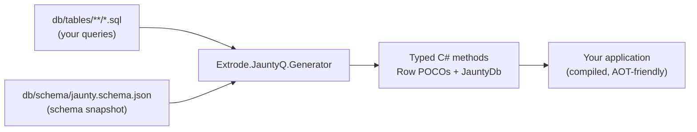

# Your first hour with JauntyQ

This is a hands-on walkthrough, not a reference page. You will create a tiny SQLite
database, point JauntyQ at it, and watch typed C# appear before you write a single
`.sql` file. Then you will write your first query, break the build on purpose (twice,
for two different reasons), and see why both breaks are good news.

Everything here runs against SQLite, so there is no server to install and no
connection string to fight with. The APIs and directives are identical on SQL
Server, PostgreSQL, and MySQL - only the `--provider` flag and the connection
string change.

## What you'll build

A `tutorial` project with:

- A `tutorial.db` SQLite file with two tables and a foreign key.
- A committed schema snapshot (`db/schema/jaunty.schema.json`).
- Zero hand-written SQL at first, then two small `.sql` files.
- A generator wired into the `.csproj` that turns both of those into typed C#.

## How the pieces fit together

JauntyQ never talks to your database at build time. It reads two things you
committed - your `.sql` files and a schema snapshot - and emits C#. Nothing here
requires a live connection during `dotnet build`.



The snapshot is produced separately, by `Extrode.JauntyQ.Cli`, against a real database
(or a file, for SQLite). You commit it like any other source file.

## Step 1: Create the database

Create `tutorial.db` from this DDL (`schema.sql`), for example with the `sqlite3`
CLI: `sqlite3 tutorial.db < schema.sql`.

```sql
CREATE TABLE Categories (
    CategoryId   INTEGER PRIMARY KEY,
    CategoryName VARCHAR(30) NOT NULL
);

CREATE TABLE Products (
    ProductId    INTEGER PRIMARY KEY,
    ProductName  VARCHAR(40) NOT NULL,
    CategoryId   INTEGER NULL REFERENCES Categories(CategoryId),
    UnitPrice    NUMERIC NULL
);

CREATE TABLE Shippers (
    ShipperId   INTEGER PRIMARY KEY,
    CompanyName VARCHAR(40) NOT NULL,
    Phone       VARCHAR(24) NULL
);

INSERT INTO Categories (CategoryName) VALUES ('Beverages'), ('Condiments');

INSERT INTO Products (ProductName, CategoryId, UnitPrice) VALUES
    ('Chai', 1, 18.00),
    ('Chang', 1, 19.00),
    ('Aniseed Syrup', 2, 10.00);

INSERT INTO Shippers (CompanyName, Phone) VALUES
    ('Speedy Express', '(503) 555-9831');
```

`INTEGER PRIMARY KEY` in SQLite is the rowid alias (auto-increment). JauntyQ's
SQLite extractor recognizes a single-column integer primary key as an identity
column, the same as `IDENTITY` on SQL Server. The explicit `VARCHAR(n)` facets
matter too: SQLite has no real column-length enforcement, so the snapshot only
records a max length when the declared type carries one - that is what makes
the value-safety step later in this guide possible.

## Step 2: Pull a schema snapshot

```bash
dotnet run --project src/Extrode.JauntyQ.Cli -f net8.0 -- schema pull \
  --provider sqlite \
  --connection "Data Source=tutorial.db" \
  --output db/schema/jaunty.schema.json
```

This writes `db/schema/jaunty.schema.json`: table names, column names, types,
nullability, primary key and identity flags, plus the foreign key from
`Products.CategoryId` to `Categories.CategoryId`. Commit this file. It is the
contract the generator validates every query against - no database connection
is needed at build time from here on.

## Step 3: Wire up the generator

```xml
<ItemGroup>
  <AdditionalFiles Include="db\**\*.sql" />
  <AdditionalFiles Include="db\schema\*.schema.json" />
</ItemGroup>

<ItemGroup>
  <ProjectReference Include="..\Extrode.JauntyQ.Generator\Extrode.JauntyQ.Generator.csproj"
                    OutputItemType="Analyzer"
                    ReferenceOutputAssembly="false" />
  <ProjectReference Include="..\Extrode.JauntyQ.Runtime\Extrode.JauntyQ.Runtime.csproj" />
</ItemGroup>
```

## Step 4: Zero SQL, full CRUD

Build the project. You have not written a single `.sql` file yet, and you
already have a typed data layer. For every table in the snapshot, JauntyQ
synthesizes `GetAll`, `GetById`, `Insert`, `Update`, and `Delete`:

```csharp
using Microsoft.Data.Sqlite;
using Extrode.JauntyQ.Generated;

using var conn = new SqliteConnection("Data Source=tutorial.db");
var db = new JauntyDb(conn);

List<Product> products = db.Products.GetAll();
Product?      chai     = db.Products.GetById(1);

// Products.CategoryId is a foreign key: you also get a loader for free.
List<Product> beverages = db.Products.GetByCategoryId(1);

int newId = db.Categories.Insert("Grains/Cereals");
db.Categories.Delete(newId);
```

This is the moment worth pausing on: nothing above came from a `.sql` file.
Every method is generated from the schema snapshot alone, with ordinal reads,
typed parameters, and an async twin (`GetAllAsync`, `GetByIdAsync`, ...) for
each one.

## Step 5: Your first custom query

Auto-CRUD covers full-table reads and single-column writes; anything with a
`WHERE`, `JOIN`, or projection is a query you write yourself. Create
`db/tables/Products/GetByCategory.sql`:

```sql
select ProductId, ProductName, CategoryId, UnitPrice
from Products
where CategoryId = @CategoryId
```

Rebuild. JauntyQ parses the file, validates every column against the
snapshot, and emits `List<Product> GetByCategory(int categoryId)` (plus
`GetByCategoryAsync`):

```csharp
List<Product> beverages = db.Products.GetByCategory(1);
```

Folder name = entity, file name (without `.sql`) = method name. That is the
entire convention.

## Step 6: One row, not a list - `-- @first`

Directives are `--` comment lines at the top of the file, stripped before the
SQL reaches the database. Create `db/tables/Products/GetByName.sql`:

```sql
-- @first
select ProductId, ProductName, CategoryId, UnitPrice
from Products
where ProductName = @ProductName
```

`-- @first` changes the return type from `List<Row>` to `Row?` - a single row
or null, instead of a list you would only ever use the first element of:

```csharp
Product? chai = db.Products.GetByName("Chai");
```

## Step 7: Getting the new id back - `-- @identity`

Auto-CRUD's synthetic `Insert` already carries `-- @identity` automatically
on tables with exactly one identity column, which is why `db.Categories.Insert(...)`
above returned an `int`. You can also write that explicitly, and override the
synthetic in the process. Create `db/tables/Categories/Insert.sql`:

```sql
-- @identity
insert into Categories (CategoryName) values (@CategoryName)
```

On SQLite (and PostgreSQL) this compiles to an insert with a `RETURNING`
clause; on SQL Server it is `OUTPUT INSERTED.<col>`; on MySQL, a narrowed
`SELECT LAST_INSERT_ID()`. You do not choose the dialect-specific SQL - the
snapshot's `dialect` field decides that for you, and the C# signature is the
same on every provider:

```csharp
int id = db.Categories.Insert("Grains/Cereals");
```

## Step 8: Break the build on purpose

This is the step that should change how you think about ORMs. Rename a
column directly in the database:

```bash
sqlite3 tutorial.db "ALTER TABLE Products RENAME COLUMN ProductName TO Name;"
```

Re-pull the snapshot so it reflects the live database:

```bash
dotnet run --project src/Extrode.JauntyQ.Cli -f net8.0 -- schema pull \
  --provider sqlite \
  --connection "Data Source=tutorial.db" \
  --output db/schema/jaunty.schema.json
```

Rebuild. `GetByCategory.sql` and `GetByName.sql` both still say
`ProductName`, and that column no longer exists. The build fails with
`JNT2002`, naming the missing column and the table it was expected on.

This is the entire point of the design. A production system without this
check would not fail here - it would fail the first time a real request hit
that query, at 2am, in front of a customer. Here it fails on your machine,
during `dotnet build`, before you ever deploy. Fix it by updating the `.sql`
files to select `Name` instead of `ProductName`, and rebuild clean.

## Step 9: Transactions with JauntyDb

`JauntyDb` exposes `BeginTransaction()` (and an async twin), returning a
`Transaction` that wraps the underlying `DbTransaction`. Instance calls on
`db.*` auto-enlist - no extra parameter to pass:

```csharp
using var tx = db.BeginTransaction();
int categoryId = db.Categories.Insert("Grains/Cereals");
db.Products.Insert("Gnocchi di Nonna Alice", categoryId, 38.00m);
tx.Commit();
```

Disposing without calling `Commit()` rolls back - the safe default if
something throws mid-flight. Static methods (`Products.Insert(conn, ...)`)
never see the `JauntyDb` that holds the transaction, so they do not
auto-enlist; stay on `db.*` inside a transaction block.

## Step 10: A value-safety error, on purpose

`Shippers.CompanyName` is `VARCHAR(40)`. Try inserting a literal that does not
fit, in a throwaway `.sql` file or directly in a query you are testing:

```sql
insert into Shippers (CompanyName, Phone)
values ('Trans National Overnight Parcel Delivery Services', '555-0100')
```

That literal is 49 characters. The build fails before it ever reaches a
database:

```
error JNT5001: String literal (49 chars) exceeds shippers.companyname max
length of 40. It would truncate on write and can never match on read.
```

The same guard runs at runtime for parameterized writes: `Insert`, `Update`,
`Upsert`, and the POCO overloads all validate string and binary parameter
lengths before opening the connection, raising an `ArgumentException` that
names the exact column and limit instead of a round-trip that ends in a
silent truncation.

## What you now have

A database with two custom queries, one deliberate build break you fixed,
one value-safety error you saw coming, and a transaction that touched two
tables atomically - all without writing a single line of ADO.NET.

The feedback loop is the whole product: rename a column, and the build tells
you where it hurts, at compile time, with the exact query and column named.
That is a fundamentally different failure mode than the one most data access
code lives with.

Continue to [exercises.md](exercises.md) to practice this on your own,
without a script to follow.
